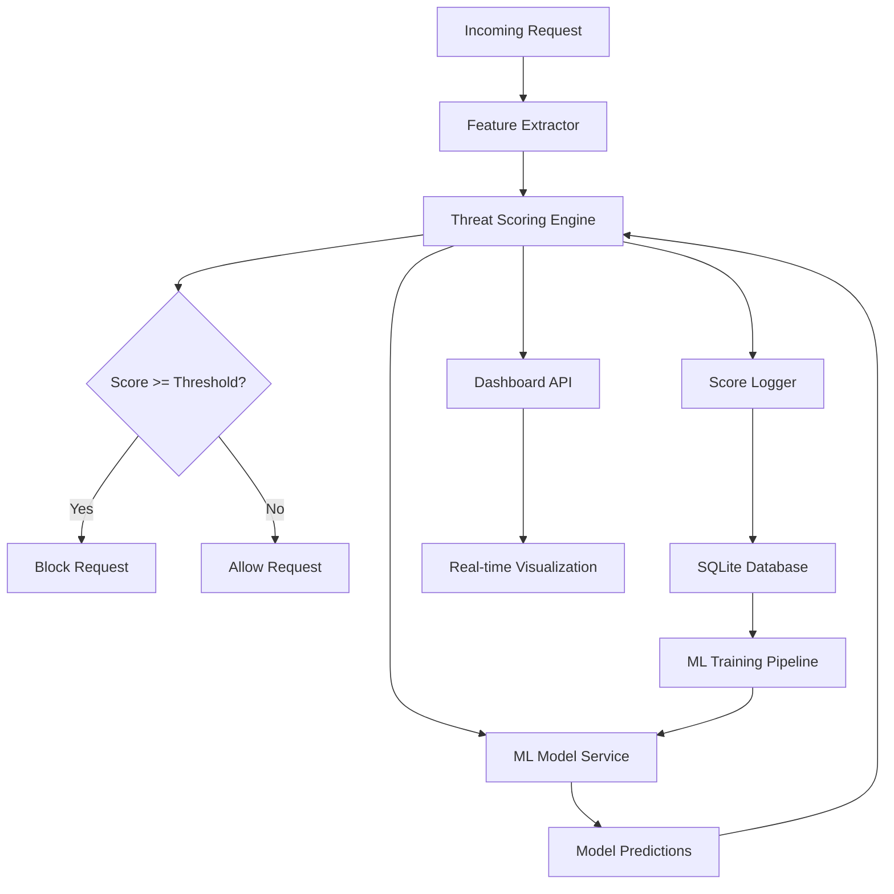

# AI-Powered Threat Scoring System Implementation Plan

## Overview

This plan outlines the implementation of an intelligent threat scoring system (0-100) that combines multiple security signals using weighted scoring with ML-trained weights. The system will analyze each request in real-time and assign a risk score, enabling more nuanced security decisions beyond simple block/allow.

## Architecture Design



## Implementation Strategy

### **Approach 1: Hybrid Rule-Based + ML System (Recommended)**

This approach combines deterministic rules with machine learning for the best of both worlds:

#### **Phase 1: Rule-Based Scoring Foundation**
Start with a weighted scoring system based on extractable features:

**Feature Categories & Weights:**

1. **Payload Analysis (35% weight)**
   - Special character density (0-20 points)
   - Entropy/randomness score (0-15 points)
   - Known malicious pattern matches (0-20 points)
   - Payload length anomaly (0-10 points)

2. **IP Reputation (25% weight)**
   - External API reputation score (0-15 points)
   - Historical attack count from this IP (0-10 points)
   - Geolocation risk factor (0-5 points)

3. **Request Patterns (20% weight)**
   - Request frequency anomaly (0-10 points)
   - HTTP method risk (0-5 points)
   - Path traversal indicators (0-10 points)
   - Header anomalies (0-5 points)

4. **Behavioral Signals (15% weight)**
   - User-Agent legitimacy (0-8 points)
   - Session consistency (0-7 points)

5. **Timing Patterns (5% weight)**
   - Request timing anomaly (0-5 points)

#### **Phase 2: ML Enhancement Layer**

Add machine learning to:
- **Refine weights** based on historical data
- **Detect novel patterns** not covered by rules
- **Reduce false positives** through learning
- **Predict attack campaigns** before they escalate

**ML Model Architecture:**
```
Input Features (25+) → Random Forest Classifier → Threat Probability (0-1)
                     ↓
              Feature Importance Analysis
                     ↓
              Weight Optimization
```

### **Approach 2: Pure ML System (Advanced)**

Train deep learning models end-to-end, but requires significant data and infrastructure.

---

## Detailed Implementation Plan

### Component 1: Feature Extraction Module

**File:** `firewall/scoring/features.go`

```go
type RequestFeatures struct {
    // Payload Features
    PayloadLength        int     `json:"payload_length"`
    SpecialCharDensity   float64 `json:"special_char_density"`
    EntropyScore         float64 `json:"entropy_score"`
    SQLiPatternMatches   int     `json:"sqli_pattern_matches"`
    XSSPatternMatches    int     `json:"xss_pattern_matches"`
    
    // IP Features
    IPReputationScore    float64 `json:"ip_reputation_score"`
    HistoricalAttacks    int     `json:"historical_attacks"`
    GeoRiskScore         float64 `json:"geo_risk_score"`
    
    // Request Pattern Features
    RequestFrequency     float64 `json:"request_frequency"`
    MethodRiskScore      float64 `json:"method_risk_score"`
    PathDepth            int     `json:"path_depth"`
    HeaderAnomalyScore   float64 `json:"header_anomaly_score"`
    
    // Behavioral Features
    UserAgentLegitimacy  float64 `json:"user_agent_legitimacy"`
    SessionConsistency   float64 `json:"session_consistency"`
    
    // Timing Features
    TimingAnomalyScore   float64 `json:"timing_anomaly_score"`
}
```

**Key Functions:**
- `ExtractFeatures(c *gin.Context) RequestFeatures`
- `CalculateEntropy(data string) float64`
- `CalculateSpecialCharDensity(data string) float64`
- `GetIPReputation(ip string) float64`

---

### Component 2: Threat Scoring Engine

**File:** `firewall/scoring/engine.go`

```go
type ThreatScore struct {
    TotalScore      float64            `json:"total_score"`
    ComponentScores map[string]float64 `json:"component_scores"`
    RiskLevel       string             `json:"risk_level"` // LOW, MEDIUM, HIGH, CRITICAL
    Confidence      float64            `json:"confidence"`
    Explanation     []string           `json:"explanation"`
}

type ScoringEngine struct {
    weights         map[string]float64
    mlClient        *MLClient
    ipCache         *IPReputationCache
    featureExtractor *FeatureExtractor
}
```

**Scoring Algorithm:**
```
1. Extract features from request
2. Calculate rule-based scores for each category
3. Query ML model for prediction (if available)
4. Combine scores using weighted average
5. Apply ML adjustment factor
6. Normalize to 0-100 scale
7. Determine risk level and generate explanation
```

---

### Component 3: ML Microservice (Python)

**File:** `ml-service/app.py`

```python
from fastapi import FastAPI
from pydantic import BaseModel
import joblib
import numpy as np

app = FastAPI()

# Load trained model
model = joblib.load('models/threat_classifier.pkl')

class RequestFeatures(BaseModel):
    payload_length: int
    special_char_density: float
    entropy_score: float
    # ... all features
    
class ThreatPrediction(BaseModel):
    threat_probability: float
    confidence: float
    feature_importance: dict

@app.post("/predict")
async def predict_threat(features: RequestFeatures):
    # Convert to numpy array
    X = np.array([[features.dict().values()]])
    
    # Get prediction
    probability = model.predict_proba(X)[0][1]
    
    # Get feature importance
    importance = dict(zip(
        features.dict().keys(),
        model.feature_importances_
    ))
    
    return ThreatPrediction(
        threat_probability=probability,
        confidence=calculate_confidence(X),
        feature_importance=importance
    )
```

---

### Component 4: Database Schema Updates

**New Tables:**

```sql
-- Threat scores table
CREATE TABLE threat_scores (
    id INTEGER PRIMARY KEY AUTOINCREMENT,
    request_id INTEGER,
    total_score REAL,
    payload_score REAL,
    ip_reputation_score REAL,
    pattern_score REAL,
    behavioral_score REAL,
    timing_score REAL,
    ml_score REAL,
    risk_level TEXT,
    confidence REAL,
    action_taken TEXT, -- ALLOWED, BLOCKED, FLAGGED
    timestamp DATETIME DEFAULT CURRENT_TIMESTAMP,
    FOREIGN KEY (request_id) REFERENCES request_logs(id)
);

-- IP reputation cache
CREATE TABLE ip_reputation_cache (
    ip TEXT PRIMARY KEY,
    reputation_score REAL,
    threat_level TEXT,
    last_updated DATETIME,
    source TEXT
);

-- Feature importance tracking
CREATE TABLE feature_weights (
    id INTEGER PRIMARY KEY AUTOINCREMENT,
    feature_name TEXT,
    weight REAL,
    model_version TEXT,
    updated_at DATETIME DEFAULT CURRENT_TIMESTAMP
);
```

---

### Component 5: IP Reputation Integration

**External APIs to integrate:**

1. **AbuseIPDB** (Free tier: 1000 requests/day)
   ```go
   func GetAbuseIPDBScore(ip string) (float64, error) {
       // API call to check IP reputation
       // Returns confidence score 0-100
   }
   ```

2. **IPQualityScore** (Free tier available)
   ```go
   func GetIPQualityScore(ip string) (float64, error) {
       // Returns fraud score 0-100
   }
   ```

3. **Local Blacklist Database**
   ```go
   func GetLocalIPScore(ip string) float64 {
       // Check against local threat intelligence
   }
   ```

**Caching Strategy:**
- Cache reputation scores for 24 hours
- Update on cache miss
- Background refresh for active IPs

---

### Component 6: Middleware Integration

**File:** `firewall/middleware.go` (modifications)

```go
func (fw *Firewall) ThreatScoringMiddleware() gin.HandlerFunc {
    return func(c *gin.Context) {
        // Extract features
        features := fw.scoringEngine.ExtractFeatures(c)
        
        // Calculate threat score
        score := fw.scoringEngine.CalculateScore(features)
        
        // Log score
        go LogThreatScore(score)
        
        // Store in context for other middleware
        c.Set("threat_score", score)
        
        // Decision logic
        if score.TotalScore >= 80 {
            fw.logThreat(c, "HIGH_THREAT_SCORE", 
                fmt.Sprintf("Score: %.2f", score.TotalScore),
                "", "", "BLOCKED")
            fw.respondBlocked(c, "Request blocked due to high threat score")
            return
        } else if score.TotalScore >= 60 {
            // Flag for review but allow
            fw.logThreat(c, "MEDIUM_THREAT_SCORE",
                fmt.Sprintf("Score: %.2f", score.TotalScore),
                "", "", "FLAGGED")
        }
        
        c.Next()
    }
}
```

---

### Component 7: Dashboard Enhancements

**New API Endpoints:**

```go
// GET /api/scores/distribution
// Returns score distribution histogram

// GET /api/scores/realtime
// WebSocket endpoint for live scores

// GET /api/scores/top-threats
// Returns highest scoring requests

// GET /api/ml/model-info
// Returns current model version and performance metrics

// GET /api/features/importance
// Returns feature importance rankings
```

**Dashboard Components:**

1. **Threat Score Gauge** - Real-time score display
2. **Score Distribution Chart** - Histogram of all scores
3. **Feature Importance Visualization** - Bar chart
4. **ML Model Performance** - Accuracy, precision, recall metrics
5. **Top Threats Table** - Highest scoring requests with details

---

## ML Training Pipeline

### Data Collection

```python
# scripts/collect_training_data.py

import sqlite3
import pandas as pd

def collect_training_data():
    conn = sqlite3.connect('firewall.db')
    
    # Join threat_scores with security_events
    query = """
    SELECT 
        ts.*,
        se.type as threat_type,
        CASE 
            WHEN se.type IS NOT NULL THEN 1 
            ELSE 0 
        END as is_threat
    FROM threat_scores ts
    LEFT JOIN security_events se ON ts.request_id = se.id
    """
    
    df = pd.read_sql_query(query, conn)
    return df
```

### Model Training

```python
# scripts/train_model.py

from sklearn.ensemble import RandomForestClassifier
from sklearn.model_selection import train_test_split
from sklearn.metrics import classification_report
import joblib

def train_threat_model():
    # Load data
    df = collect_training_data()
    
    # Feature engineering
    feature_cols = [
        'payload_score', 'ip_reputation_score',
        'pattern_score', 'behavioral_score', 'timing_score'
    ]
    
    X = df[feature_cols]
    y = df['is_threat']
    
    # Split data
    X_train, X_test, y_train, y_test = train_test_split(
        X, y, test_size=0.2, random_state=42
    )
    
    # Train model
    model = RandomForestClassifier(
        n_estimators=100,
        max_depth=10,
        random_state=42
    )
    model.fit(X_train, y_train)
    
    # Evaluate
    y_pred = model.predict(X_test)
    print(classification_report(y_test, y_pred))
    
    # Save model
    joblib.dump(model, 'models/threat_classifier.pkl')
    
    # Extract and save feature weights
    importance = dict(zip(feature_cols, model.feature_importances_))
    save_feature_weights(importance)
```

---

## Implementation Timeline

### Week 1: Foundation
- [ ] Implement feature extraction module
- [ ] Create basic scoring engine with rule-based weights
- [ ] Add database schema updates
- [ ] Basic testing with existing traffic

### Week 2: ML Integration
- [ ] Set up Python ML microservice
- [ ] Implement Go-Python communication
- [ ] Train initial model on historical data
- [ ] Integrate ML predictions into scoring

### Week 3: IP Reputation & Optimization
- [ ] Integrate external IP reputation APIs
- [ ] Implement caching layer
- [ ] Performance optimization
- [ ] Weight tuning based on real data

### Week 4: Dashboard & Testing
- [ ] Add dashboard visualizations
- [ ] Implement real-time score monitoring
- [ ] Comprehensive testing
- [ ] Documentation and deployment

---

## Configuration

**File:** `firewall/config/scoring.yaml`

```yaml
threat_scoring:
  enabled: true
  
  thresholds:
    block: 80      # Block requests >= 80
    flag: 60       # Flag requests >= 60
    monitor: 40    # Monitor requests >= 40
  
  weights:
    payload_analysis: 0.35
    ip_reputation: 0.25
    request_patterns: 0.20
    behavioral_signals: 0.15
    timing_patterns: 0.05
  
  ml:
    enabled: true
    service_url: "http://localhost:8000"
    timeout: 100ms
    fallback_to_rules: true
  
  ip_reputation:
    cache_ttl: 86400  # 24 hours
    apis:
      - name: "abuseipdb"
        enabled: true
        api_key: "${ABUSEIPDB_API_KEY}"
      - name: "ipqualityscore"
        enabled: false
        api_key: "${IPQS_API_KEY}"
```

---

## Testing Strategy

### Unit Tests
```go
func TestFeatureExtraction(t *testing.T) {
    // Test entropy calculation
    // Test special char density
    // Test pattern matching
}

func TestScoringEngine(t *testing.T) {
    // Test score calculation
    // Test threshold logic
    // Test weight application
}
```

### Integration Tests
```bash
# Test with known malicious payloads
curl -X POST http://localhost:8080/app \
  -d "username=admin' OR '1'='1"

# Test with legitimate requests
curl http://localhost:8080/app/dashboard

# Test rate limiting impact on scores
for i in {1..50}; do curl http://localhost:8080/app; done
```

### Performance Benchmarks
- Target: < 5ms scoring overhead per request
- ML service: < 50ms response time
- IP reputation cache hit rate: > 90%

---

## Monitoring & Observability

### Metrics to Track
1. **Scoring Performance**
   - Average score calculation time
   - ML service response time
   - Cache hit rates

2. **Model Performance**
   - Prediction accuracy
   - False positive rate
   - False negative rate

3. **Business Metrics**
   - Blocked requests by score
   - Score distribution over time
   - Top scoring attack types

---

## Future Enhancements

1. **Advanced ML Models**
   - Deep learning for payload analysis
   - LSTM for sequence-based detection
   - Ensemble methods for better accuracy

2. **Automated Retraining**
   - Continuous learning from new data
   - A/B testing for model versions
   - Automated weight optimization

3. **Explainable AI**
   - SHAP values for feature importance
   - Visual explanations for blocked requests
   - Confidence intervals

4. **Multi-Model Approach**
   - Specialized models for different attack types
   - Model routing based on request characteristics
   - Ensemble predictions

---

## Risk Mitigation

> [!WARNING]
> **Potential Issues & Solutions**

1. **ML Service Downtime**
   - Solution: Fallback to rule-based scoring
   - Implement circuit breaker pattern

2. **High False Positive Rate**
   - Solution: Start with monitoring mode
   - Gradual threshold adjustment
   - Whitelist trusted IPs

3. **Performance Impact**
   - Solution: Async scoring for non-critical paths
   - Caching and optimization
   - Feature selection to reduce computation

4. **Data Privacy**
   - Solution: Hash sensitive data before ML training
   - Implement data retention policies
   - GDPR compliance measures

---

## Success Metrics

- ✅ **95%+ accuracy** in threat detection
- ✅ **< 5% false positive rate**
- ✅ **< 10ms scoring latency**
- ✅ **Detect 20%+ more threats** than rule-based system alone
- ✅ **90%+ user satisfaction** with reduced false positives

